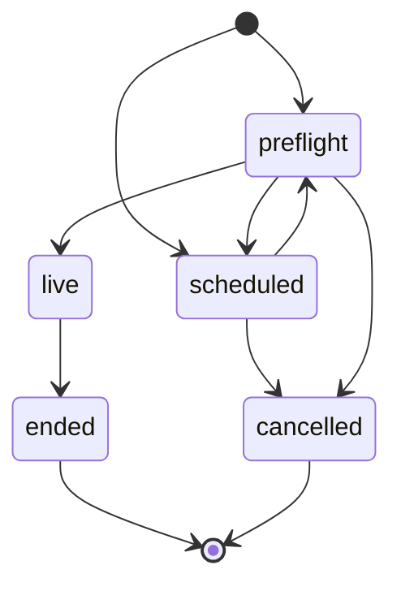

# Backend foundation

## Data ownership

| Entity | Owner | Public access | Realtime |
| --- | --- | --- | --- |
| Profile | Auth user | Readable | No |
| Stream | Creator | Discoverable states only | Lifecycle API |
| Follow | Follower | Readable counts/relationships | No |
| Chat message | Author; creator can moderate | Visible messages in accessible rooms | Inserts |
| Safety report | Reporter | Reporter only | No |

## Stream state machine

Postgres enforces these transitions, so a bypassed UI or alternate client cannot create an impossible lifecycle.

## Request boundaries

- Browser components use only the project URL and publishable key.
- Server Components, Route Handlers, and the root proxy use request-scoped cookie clients.
- Server authorization validates JWT claims before protected mutations.
- Data writes still pass through RLS; application checks improve errors but do not replace database authorization.
- Video transport is selected through `getLiveVideoProvider()`. Only the non-broadcasting demo provider is enabled in this milestone.

## Production connection checklist

1. Create a dedicated LIVEAPP Supabase project.
2. Run the migration dry-run and review its target project ref.
3. Apply the migration and run Supabase security/performance advisors.
4. Add the production site URL and callback URL to Supabase Auth.
5. Configure the project URL and publishable key in the hosting environment.
6. Test sign-in, profile creation, stream transitions, chat RLS, and reconnect behavior.
7. Select a live-video provider only after latency, regional coverage, recording, moderation, and cost tests.
